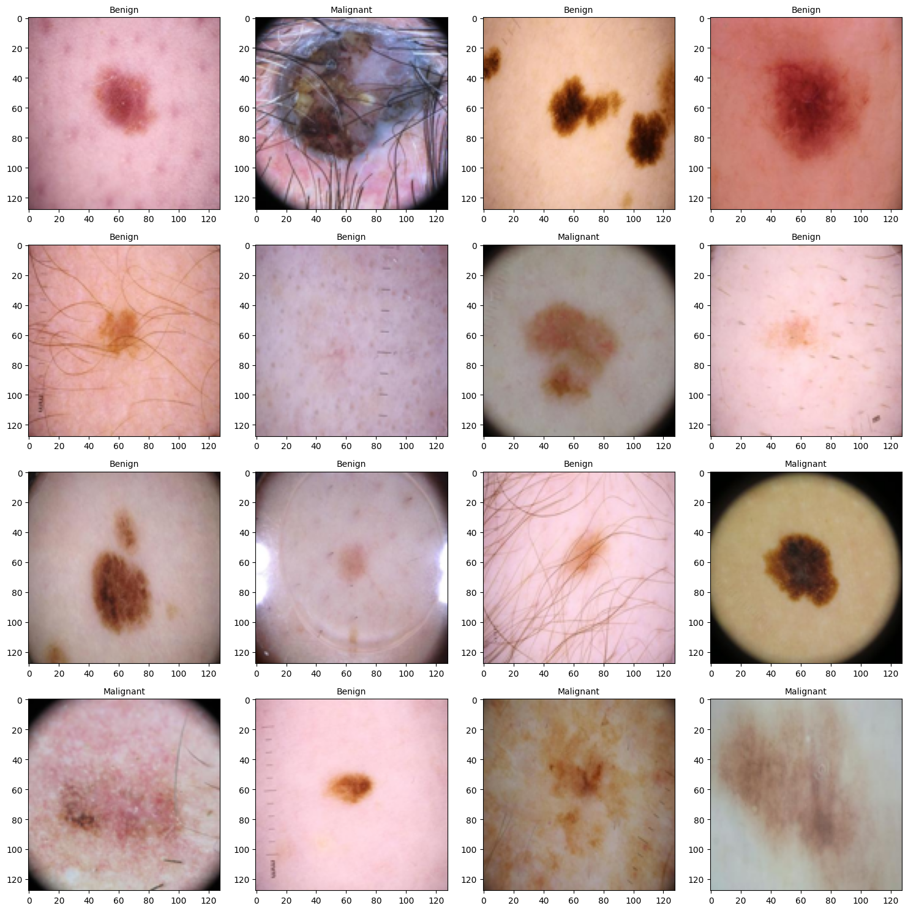
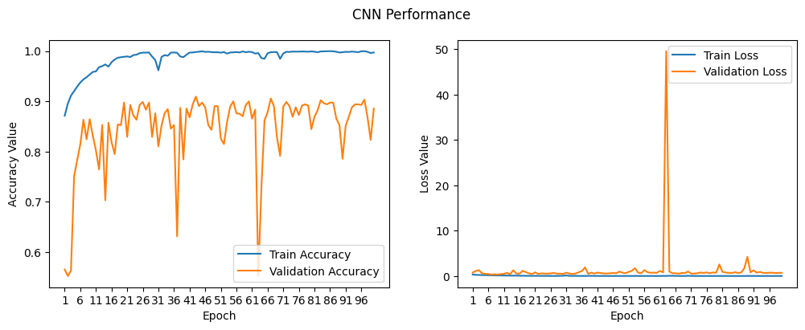

# Melanoma Classification using CNN

This repository contains a Convolutional Neural Network (CNN) model for classifying melanoma from benign moles using dermoscopic images. The model is trained and evaluated on a dataset of skin lesion images.

## Model Architecture

The CNN architecture consists of the following layers:

| Layer (type)               | Output Shape       | Param #    |
|----------------------------|--------------------|------------|
| input_layer (InputLayer)   | (None, 128, 128, 3)| 0          |
| conv2d (Conv2D)            | (None, 128, 128, 32)| 896        |
| max_pooling2d (MaxPooling2D)| (None, 64, 64, 32) | 0          |
| batch_normalization (BatchNormalization)| (None, 64, 64, 32)| 128 |
| dropout (Dropout)          | (None, 64, 64, 32) | 0          |
| conv2d_1 (Conv2D)          | (None, 64, 64, 32) | 9,248      |
| max_pooling2d_1 (MaxPooling2D)| (None, 32, 32, 32)| 0          |
| batch_normalization_1 (BatchNormalization)| (None, 32, 32, 32)| 128 |
| dropout_1 (Dropout)        | (None, 32, 32, 32) | 0          |
| flatten (Flatten)          | (None, 32768)      | 0          |
| dense (Dense)              | (None, 512)        | 16,777,728 |
| batch_normalization_2 (BatchNormalization)| (None, 512) | 2,048 |
| dropout_2 (Dropout)        | (None, 512)        | 0          |
| dense_1 (Dense)            | (None, 512)        | 262,656    |
| batch_normalization_3 (BatchNormalization)| (None, 512) | 2,048 |
| dropout_3 (Dropout)        | (None, 512)        | 0          |
| dense_2 (Dense)            | (None, 2)          | 1,026      |

## Dataset

The dataset consists of dermoscopic images labeled as either "Benign" or "Malignant." Below is a sample visualization of the dataset:



## Training and Validation

The model was trained for 100 epochs. The performance metrics are shown in the plots below:

- **Left Plot**: Accuracy over epochs for training and validation sets.
- **Right Plot**: Loss over epochs for training and validation sets.



## Results

The model achieved the following results:

- **Training Accuracy**: High accuracy with low loss.
- **Validation Accuracy**: Fluctuations indicate potential overfitting, which can be addressed by further tuning hyperparameters or augmenting the dataset.

## Usage

### Prerequisites

Ensure you have the following libraries installed:

```bash
pip install tensorflow matplotlib numpy opencv-python
```

### Running the Model

1. Clone the repository:

```bash
git clone <repository-url>
cd <repository-folder>
```

2. Run the `model.ipynb` code. It will save the trained model as an `.h5` file named `melanoma_cnn.h5` in your local `Desktop` folder.

3. Once the `.h5` file is generated, upload your own image to the `test_data` folder. Then, edit **cell 3** of `model_test.ipynb` to match the name of your file and run all the cells.

```python
image = cv2.imread('test_data/name_of_your_image.jpg')
```

## Future Work

- Implement data augmentation to improve generalization.
- Experiment with different architectures and hyperparameter tuning.
- Incorporate transfer learning for improved performance.
